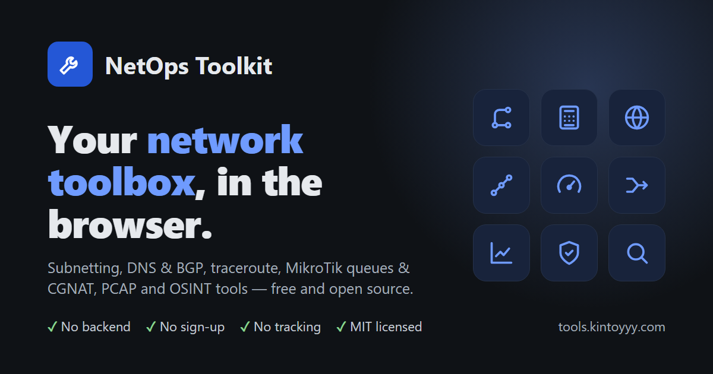
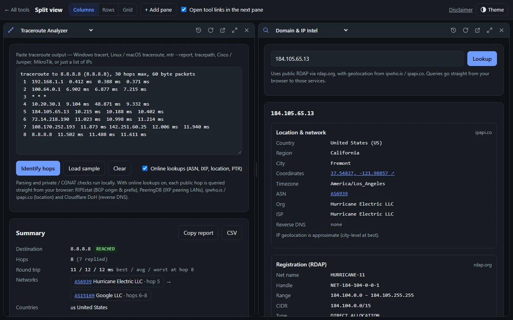
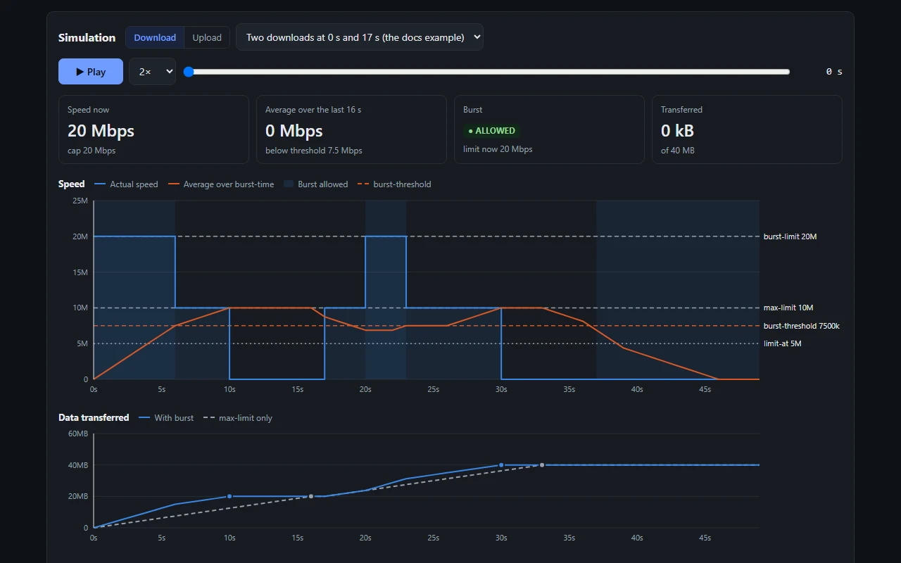
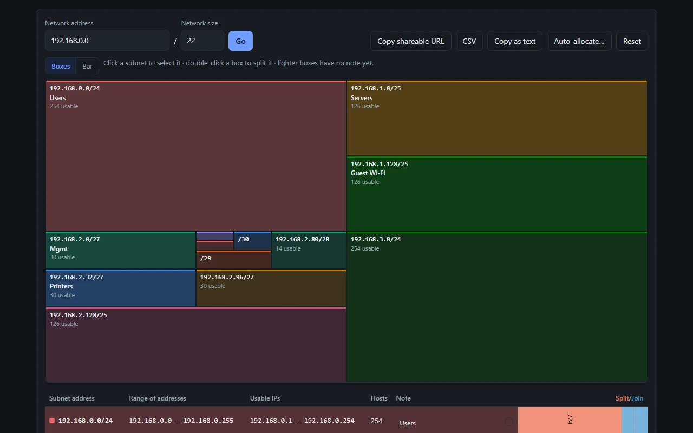
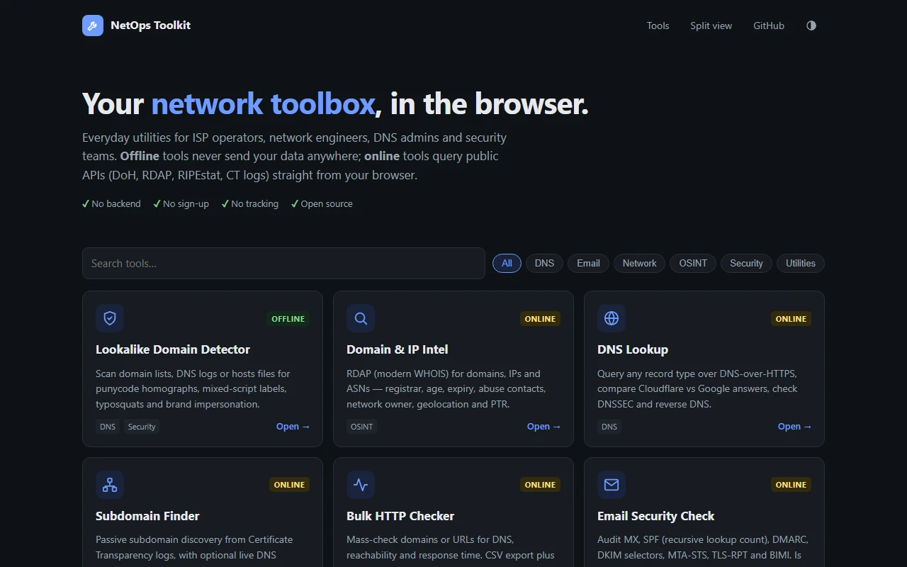

<p align="center">
  <a href="https://tools.kintoyyy.com"></a>
</p>

<p align="center">
  Browser-based tools for ISP operators, network engineers, DNS admins and security teams.<br>
  No backend · no sign-up · no tracking — <b><a href="https://tools.kintoyyy.com">tools.kintoyyy.com</a></b>
</p>

<table>
  <tr>
    <td></td>
    <td></td>
  </tr>
  <tr>
    <td></td>
    <td></td>
  </tr>
</table>

## Tools

- **Network** — [Subnet Calculator](https://tools.kintoyyy.com/tools/subnet-calc/) · [Subnet Visualizer](https://tools.kintoyyy.com/tools/subnet-visualizer/) · [BGP Toolkit](https://tools.kintoyyy.com/tools/bgp-toolkit/) · [Traceroute Analyzer](https://tools.kintoyyy.com/tools/traceroute-analyzer/) · [MikroTik Burst Calculator](https://tools.kintoyyy.com/tools/mikrotik-burst/) · [MikroTik CGNAT Generator](https://tools.kintoyyy.com/tools/mikrotik-cgnat/) · [My IP & Connection](https://tools.kintoyyy.com/tools/my-connection/) · [Bulk HTTP Checker](https://tools.kintoyyy.com/tools/http-check/) · [MAC Address Lookup](https://tools.kintoyyy.com/tools/mac-lookup/) · [PCAP Analyzer](https://tools.kintoyyy.com/tools/pcap-analyzer/)
- **DNS & email** — [DNS Lookup](https://tools.kintoyyy.com/tools/dns-lookup/) · [Subdomain Finder](https://tools.kintoyyy.com/tools/subdomains/) · [Email Security Check](https://tools.kintoyyy.com/tools/email-security/) · [Email Header Analyzer](https://tools.kintoyyy.com/tools/email-headers/) · [Blocklist Converter](https://tools.kintoyyy.com/tools/blocklist-converter/)
- **Security & OSINT** — [Domain & IP Intel](https://tools.kintoyyy.com/tools/domain-intel/) · [IOC Extractor & Defanger](https://tools.kintoyyy.com/tools/ioc-extractor/) · [Lookalike Domain Detector](https://tools.kintoyyy.com/tools/lookalike-domains/)
- **Utilities** — [Encode / Decode](https://tools.kintoyyy.com/tools/encode-decode/) · [Recursive Decoder](https://tools.kintoyyy.com/tools/recursive-decoder/) · [Classical Cipher Solver](https://tools.kintoyyy.com/tools/cipher-solver/) · [XOR Cracker](https://tools.kintoyyy.com/tools/xor-cracker/) · [File Analyzer](https://tools.kintoyyy.com/tools/file-analyzer/) · [Image Steganography](https://tools.kintoyyy.com/tools/image-stego/) · [RSA Toolkit](https://tools.kintoyyy.com/tools/rsa-toolkit/)

Use several at once in [Split view](https://tools.kintoyyy.com/split/). Offline tools never send your data anywhere; online tools call public APIs (DoH, RDAP, RIPEstat, PeeringDB…) straight from your browser.

## Develop

```sh
python3 build.py
```

Builds `tools/<slug>/` from `src/<slug>.html` and refreshes page metadata and the sitemap. To add a tool, create `src/my-tool.html` (first line `<!-- title: … | desc: … -->`), add it to `TOOLS` in `assets/tools.js`, then build. GitHub Pages serves the repo root.

## License

[MIT](LICENSE) — provided as is, without warranty. See the [disclaimer](https://tools.kintoyyy.com/disclaimer/).
